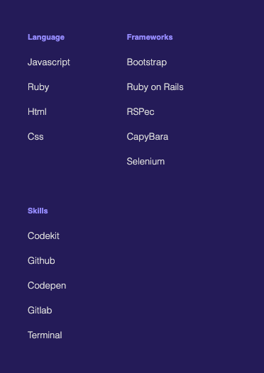
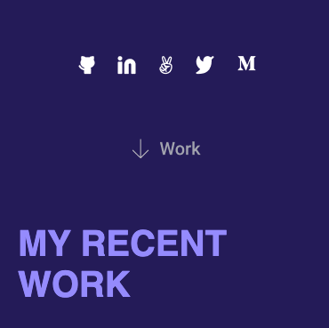
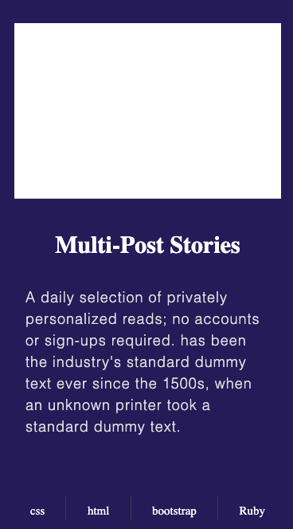
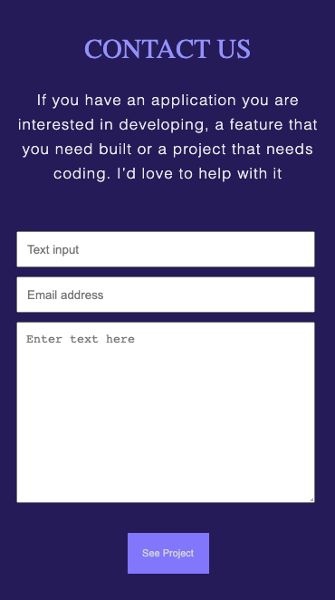

# Portfolio-setup-and-mobile-version-skeleton

> This is about using figma to built our mobile project.

Mobile ScreenShots

## Built With

- HTML and CSS

## Skills

  - Know about HTML and CSS.
  - Ability to learn figma and new tools.

## Getting Started

### Prerequisites
  - Know about Linters, HTML and CSS.
### Setup
  - Start with a copy of your old project from trials.
### Install
  - Linters
### Usage
  - Fix Errors

## Authors

👤 **Christian Contreras**

- GitHub: [@eri9-9](https://github.com/eri8-9)

## Show your support

Give a ⭐️ if you like this project!

## Acknowledgments

-Microverse

## 📝 License

This project is [MIT](./MIT.md) licensed.